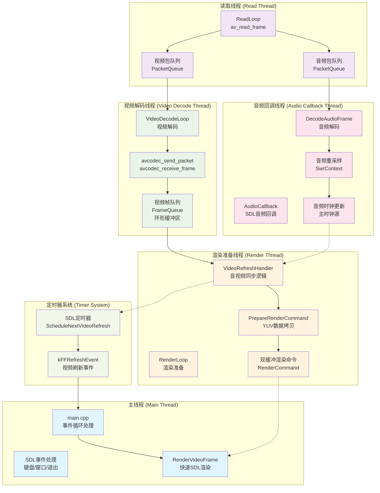
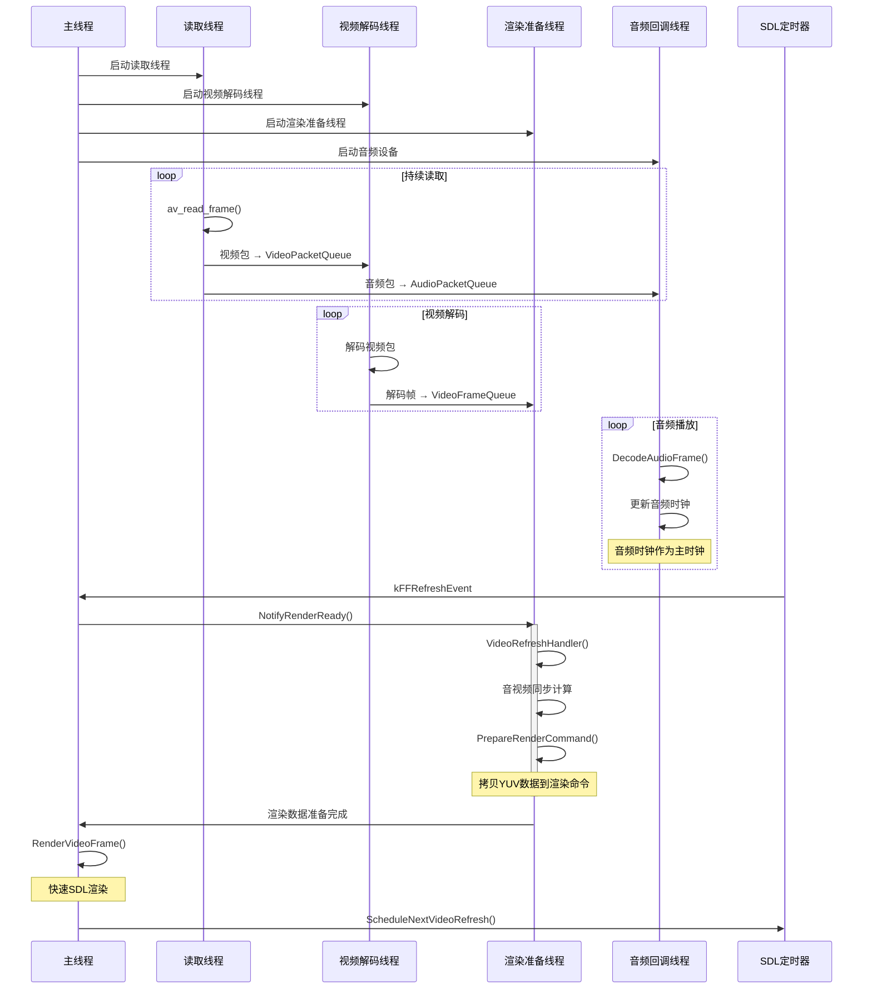
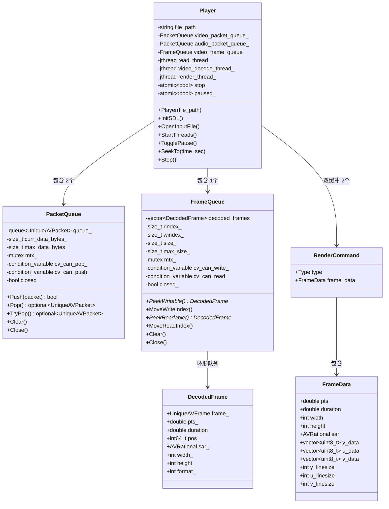

# AVPlayer - 基于 FFmpeg & SDL2 的现代 C++ 音视频播放器

[](https://isocpp.org/)
[](https://ffmpeg.org/)
[](https://www.libsdl.org/)
[](https://xmake.io/)

## 项目简介

AVPlayer 是一个高性能的音视频播放器，采用现代 C++20 标准开发，基于 FFmpeg 进行音视频解码，使用 SDL2 进行音频播放和视频渲染。该项目展示了流媒体技术的核心概念，包括多线程架构、音视频同步、内存管理和性能优化等。

### 核心特性

- 🎥 **多格式支持**: 支持 H.264/H.265 视频编码和 AAC/Opus 音频编码
- 🎵 **音视频同步**: 基于音频时钟的精确同步算法，支持动态同步阈值调整
- 🔄 **多线程架构**: 读取、解码、渲染线程分离，确保流畅播放体验
- ⚡ **高性能设计**: 零拷贝优化、环形队列、双缓冲渲染
- 🎮 **交互控制**: 支持播放/暂停、快进/快退、Seek 操作
- 📊 **智能缓冲**: 动态包队列管理，防止内存溢出
- 🛡️ **资源安全**: RAII 设计原则，智能指针管理 FFmpeg/SDL 资源

## 项目框架

### 整体架构图



### 多线程同步机制



### 核心类关系图



## 技术栈

### 核心依赖

| 技术栈 | 版本要求 | 用途 |
|--------|----------|------|
| **C++** | C++20 | 现代C++特性，jthread、概念、范围等 |
| **FFmpeg** | 4.0+ | 音视频解复用、解码 (`libavformat`, `libavcodec`, `libavutil`, `libswresample`) |
| **SDL2** | 2.0+ | 音频播放、视频渲染、事件处理 |
| **spdlog** | 1.8+ | 高性能日志系统 |
| **cxxopts** | 3.0+ | 命令行参数解析 |

### 构建系统

- **xmake**: 现代化的构建系统，支持包管理和跨平台编译

## 快速开始

### 环境要求

- Linux/Windows/macOS
- GCC 10+ / Clang 12+ / MSVC 2019+
- xmake 2.6+

### 安装依赖

```bash
# 安装 xmake
curl -fsSL https://xmake.io/shget.text | bash

# 或者通过包管理器安装
# Ubuntu/Debian
sudo apt install xmake

# macOS
brew install xmake
```

### 构建项目

```bash
# 克隆项目
git clone <repository-url>
cd AVPlayer

# 配置并构建
xmake config --mode=release
xmake build

# 运行播放器
xmake run avplayer <视频文件路径>
```

### 使用示例

```bash
# 基本播放
./build/avplayer video.mp4

# 设置日志级别
./build/avplayer video.mp4 --loglevel debug

# 自定义日志目录
./build/avplayer video.mp4 --logdir ./custom_logs

# 查看帮助
./build/avplayer --help
```

### 控制操作

| 按键 | 功能 |
|------|------|
| `空格键` | 播放/暂停切换 |
| `←` | 快退 5 秒 |
| `→` | 快进 5 秒 |
| `ESC` 或关闭窗口 | 退出播放器 |

## 核心技术实现

### 1. 多线程架构设计

AVPlayer 采用经典的生产者-消费者模式，通过多个专用线程实现高效的音视频处理：

- **读取线程**: 负责从文件中读取音视频数据包，填充到对应的包队列
- **视频解码线程**: 从视频包队列取包解码，将解码后的帧放入帧队列
- **渲染准备线程**: 处理音视频同步逻辑，准备渲染数据
- **音频回调线程**: SDL 音频设备回调，实时解码和播放音频
- **主线程**: 处理 SDL 事件，执行快速渲染操作

### 2. 音视频同步算法

采用**音频时钟作为主时钟**的同步策略：

```cpp
// 动态同步阈值计算
double sync_threshold = std::max(kMinAvSyncThreshold, 
                                std::min(kMaxAvSyncThreshold, frame_duration));

// 音视频时间差计算
double diff = frame_pts - ref_clock;

if (diff <= -sync_threshold) {
    // 视频落后，丢帧追赶
    video_frame_queue_.MoveReadIndex();
    ScheduleNextVideoRefresh(0);
} else if (diff >= sync_threshold) {
    // 视频超前，增加延迟
    av_sync_delay = frame_duration * 2;
}
```

### 3. 内存管理与性能优化

#### RAII 智能指针封装

```cpp
// FFmpeg 资源管理
using UniqueAVFormatContext = std::unique_ptr<AVFormatContext, AVFormatContextDeleter>;
using UniqueAVCodecContext = std::unique_ptr<AVCodecContext, AVCodecContextDeleter>;
using UniqueAVFrame = std::unique_ptr<AVFrame, AVFrameDeleter>;

// SDL 资源管理
using UniqueSDLWindow = std::unique_ptr<SDL_Window, SDLWindowDeleter>;
using UniqueSDLRenderer = std::unique_ptr<SDL_Renderer, SDLRendererDeleter>;
```

#### 环形队列设计

```cpp
class FrameQueue {
private:
    std::vector<DecodedFrame> decoded_frames_;  // 预分配环形缓冲区
    size_t rindex_{0};    // 读取索引
    size_t windex_{0};    // 写入索引
    size_t size_{0};      // 当前帧数
    size_t max_size_{0};  // 最大帧数
};
```

#### 双缓冲渲染

```cpp
// 渲染命令双缓冲，避免主线程阻塞
std::atomic<RenderCommand*> curr_render_cmd_{nullptr};
RenderCommand render_cmds_[2];
std::atomic<int> write_cmd_idx_{0};
```

### 4. 线程安全设计

- **无锁编程**: 使用原子操作和双缓冲减少锁竞争
- **细粒度锁**: 分离格式上下文、编解码器、时钟的互斥锁
- **条件变量**: 高效的线程同步和唤醒机制

## 项目结构

```
AVPlayer/
├── include/avplayer/          # 头文件目录
│   ├── core.hpp              # 核心数据结构和工具类
│   ├── logger.hpp            # 日志系统封装
│   └── player.hpp            # 播放器主类
├── src/                      # 源文件目录
│   ├── core.cpp              # PacketQueue 和 FrameQueue 实现
│   ├── logger.cpp            # 日志系统实现
│   ├── main.cpp              # 程序入口和事件循环
│   └── player.cpp            # 播放器核心逻辑实现
├── docs/                     # 文档目录
│   └── ffmpeg_api.md         # FFmpeg API 使用指南
├── xmake.lua                 # 构建配置文件
├── run.sh                    # 快速运行脚本
└── README.md                 # 项目文档
```

## 性能特性

### 延迟优化
- **低延迟渲染**: 主线程快速 SDL 渲染，避免阻塞
- **预解码缓冲**: 智能缓冲策略，平衡内存使用和播放流畅度
- **零拷贝优化**: 减少不必要的数据拷贝操作

### 内存管理
- **动态缓冲**: 根据码率和网络状况动态调整缓冲区大小
- **内存池**: 重用 AVFrame 和 AVPacket 对象
- **智能释放**: RAII 保证资源及时释放

### CPU 优化
- **多核并行**: 充分利用多核 CPU 进行并行处理
- **缓存友好**: 数据结构设计考虑 CPU 缓存局部性
- **分支预测**: 减少条件分支，提高指令流水线效率

## 开发指南

### 添加新的编解码器支持

1. 在 `OpenStreamComponent()` 中添加编解码器检测逻辑
2. 根据需要扩展音频重采样参数
3. 更新 `DecodeAudioFrame()` 或 `DecodeVideoFrame()` 处理逻辑

### 扩展控制功能

1. 在 `main.cpp` 的事件循环中添加新的按键处理
2. 在 `Player` 类中实现对应的控制方法
3. 考虑线程安全和状态一致性

### 性能调优

1. 调整队列大小常量 (`kMaxPacketQueueDataBytes`, `kMaxFrameQueueSize`)
2. 优化同步阈值 (`kMaxAvSyncThreshold`, `kMinAvSyncThreshold`)
3. 根据硬件特性调整线程优先级
